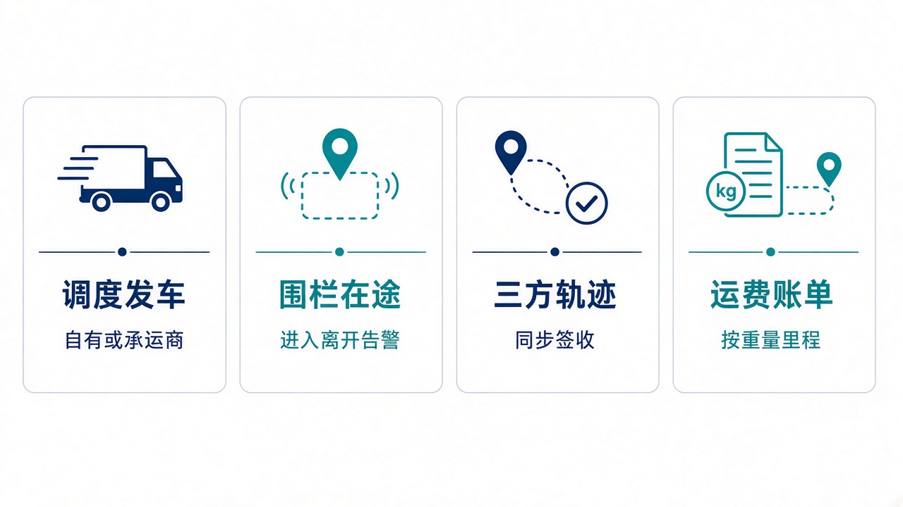
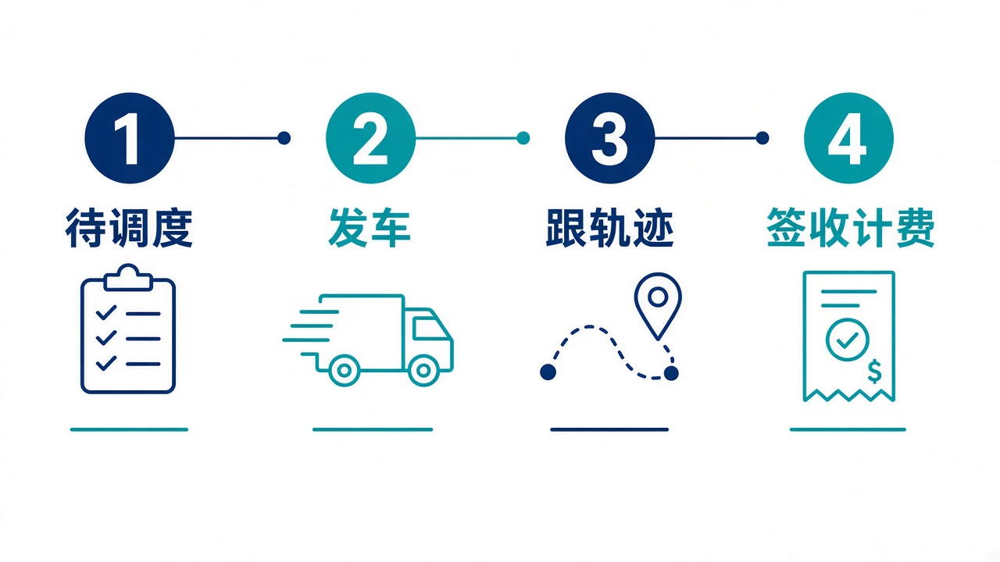

# 给大家讲：运输系统怎么用

TMS 管运输订单、调度、在途和运费。自有车辆和三方承运商走同一张运单。控制塔可以调度、追轨迹、换承运商，账单仍在本系统计算。亮点短表见 [项目亮点](./项目亮点.md)。

## 适合什么场景

| 场景 | 在这里怎么做 |
| --- | --- |
| 有货要发出去 | 把运输订单调度成运单，选自有车辆或三方承运商 |
| 想知道车进没进区域 | 看 GPS、轨迹事件，以及圆形或多边形围栏的进入和离开 |
| 承运商已经签收，系统还停在途中 | 同步三方轨迹，或由控制塔按运单号触发同步 |
| 这条线太贵或太慢 | 按运单换承运商。控制塔上的节约是运价差，不是已经重算的账单 |
| 要给客户或结算出运费 | 按重量、体积、件数或里程计费，支持首续单位和最低收费 |

## 亮点

1. 发车、到达、签收、关闭、取消都落在运单上。
2. 顺丰、京东、中通的模拟适配器能拉轨迹并回调签收。
3. 控制塔写指令只打开放口，不会再走一套登录后的运单页，避免同一张单被改两次。
4. 运费账单可以单独查，也可以给控制塔做成本快照。已经进入结算的运费，以结算为准。

## 一天怎么用

1. 看工作台里的待调度订单和告警。
2. 调度并发车。载重和计费重在订单上已经算过。
3. 跟在途。异常和围栏告警优先处理。
4. 签收后看运费是否生成，再交给结算。

发行包默认端口和控制塔种子都是 `8082`。源码直接启动仍是 `8080`。
